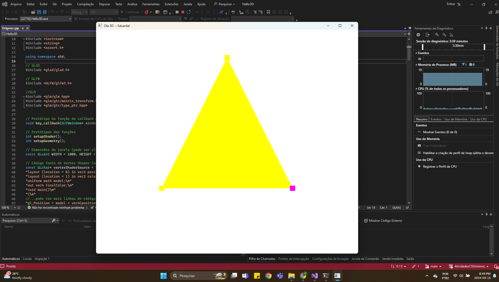

# Computação Gráfica

## Eduarda Vargas dos Santos

### Tarefa M1: 

### Tarefa M2:
#### Controle de rotação:
- Eixo x: tecla X
- Eixo y: tecla Y
- Eixo z: tecla Z

#### Controle de translação:
- Eixo x: setas direita e esquerda
- Eixo y: setas para cima e para baixo
- Eixo z: teclas W e S

#### Controle de escala:
- Teclas + e -
 

### Tarefa M3:

### Tarefa M4:

### Tarefa M5:
#### Controles dos objetos
##### Controle de rotação:
- Eixo x: tecla X
- Eixo y: tecla Y
- Eixo z: tecla Z

##### Controle de translação:
- Eixo x: setas direita e esquerda
- Eixo y: setas para cima e para baixo
- Eixo z: teclas I e K

##### Controle de escala:
- Teclas + e -
 
#### Controles da camera
##### Zoom + e -:
- Scroll do mouse

##### Direção da camera:
- Movimentação do mouse

##### Movimentação da camera:
- Eixo x: setas A e D
- Eixo z: setas W e S

